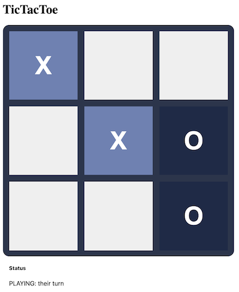
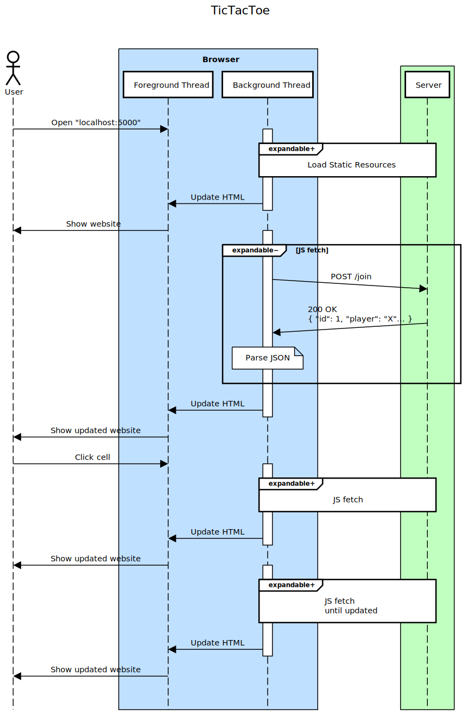

# TicTacToe Webapp

A game of TicTacToe as webapp. Two users load the client-side code (HTML, CSS, Javascript) from the server and can then play against each other.
The game state is managed on the server, the client (browser) merely displays the state received from the server, and can issue commands to place
a piece in a free cell.

## Components

The game consists of two systems: the server, and the client (web-browser).

### Client (Browser)
The loads static client-side resources (HTML, CSS, Javascript) from the server. The Javascript then uses asynchronous `fetch`to connect to the JSON
endpoints defined by the server, in order to join a game, to view it's state, and to take turns in setting pieces.

The server-side state of a game can change without a user event, e.g. because the other player set a piece. In order to update the client's
view of the game, it continuously polls the server for the current game state using the `/view` endpoint.

### Server
The server has two roles:
1. It serves the static resources needed by the client (HTML, CSS, Javascript).
2. It responds to queries to its JSON endpoints by returning the JSON data corresponding to the underlying game.

The server is implemented in Javascript, on top of [Node.js](https://nodejs.org/) and [Express](https://expressjs.com/).

#### Installing Node
  * Install Node:
    * https://nodejs.org/en/download/prebuilt-installer
  * Initialize the project:
     * `npm init`
     * `npm install express`
     * mark as `  "type": "module"` in `package.json'
     * make sure to git-ignore `node-modules`

There are two main parts in the Python code:
1. The logic for a single game of TicTacToe is defined in [`tictactoe.py`](tictactoe.py).
2. [`app.py`](app.py) defines the endpoints supported by the webapp
    - The root (`/`) URL is redirected to [`/static/tictactoe.html`](static/tictactoe.html)
    - Flask automagically serves any files from the [`/static`](static) folder as static resources.
    - The three JSON endpoints are defined using `@app.route` annotations.

## Sequence Diagram
The diagram below shows the sequence of events during the initial loading of the game (static resources), and during the game play (JSON fetched via asynchronous javascript fetch).

Click for an interactive version that allows expansion of the various steps.

[](https://sequencediagram.org/index.html?presentationMode=readOnly#initialData=C4S2BsFMAIBUQMawIZIPaQFCdcNAnaAVQGdJ9MAHZfUBEagO2AHN80BXS6AYgQAZI-AGbDoAKnEAhdgHcy+SVRp0GyZtABiBSG06MAJnAAW+SMgPLaiNRqmoA1no6GTZi5kiGrqpq3ZcvAKiAj42ftAAyuQAbuSe3tik5AC0AHzaZs6usKbmBgBcAPKUXtAAROBoCMjgxmgkwAUArPxt5TgIoDHIwDD2CE4BOXkekAAeTAbIAEZQANTQADJoFlHAvYjQAEqQJJz4CHuYA0P6RrnuBukAFACMAJTR+HH4BQDiAKKw0AD0mM9XrdHqdshdRoUAMz8ABM0DMBhAZi6AB1GL9GpsEL86BsuhgAHTGYAAW3AJ0cYLc+WBT1i5A+3z+mLoOMQeLwkCJpPJgNSaXuD1Bw3BVwKMLa0CKAGk0Qo4iQ-hiNqzcbhCcSyb9-ow0H1oGhXtBhedqRYCgAFGhkaAACVgAFklmjhCBXHrjOR4XsDkdFXhoFUPCaXKKaQLHny3l8fsqsWyuuquQgSCQAfT8LSQyMxRL+FLZYx5XslSzEAmOYSUyRtRTBlTLuHBVHGbGy9i1fiuQArNNRrOUkVmwp5gty+mK7XtitJgm92teSzZsMWdKZXRDxvmoiUab6+1OzAGcxdEA9PrIYR9QjL4eYdcNiHpZJvSL1WTQWSQGYkMBYTrdL0-SDqaW6WBMUyzFAgBIRNAABSkTQMIkDAAgxh1mcobDrSLYWkUkSxt2aBuumLz8oKt5geKkoymiADeFQgAY5QFNAdwADQVJQ4DIAAnuQLEVAAGuUBJidAAC+mC6vqhpepREKWtaMAIUUAByCRLiBWFgWuOiPmKO57jAB5LEeJ6AReV7ydpOb5Pe+mbk+aQvgUb5oB+XDGUYX4-n+SQKHpWROWKADC4CIA40BHOA5K4GeQHGrZK7gZM6jTHMkCLAhSEoWhGEGU2kYZpa+Ftihvx3L8Qm-AALKRQIRkKyXDtR+a0YwDHlExgkcRUjATMAgnlEUoniVJMkwHJN4tVRVr4DaqkaYuBUheGD5rduu6JaZ5nxee5jWTN9abZYG2gc5rnuZ5219D536-n02D7YlClXJ4aWGFBWXwYhyGocYaIuKA4DQF5QFaSdF1XDhJV4QRfwxCAkCyJV1UNeRIKzYpo4dV1PWsX15QDeMQ2sSNY0EpJ0l6lNRpvfkSkLSpkTqZpq3Q+tjmc1txl2o6ZnHi9VnXklUM6RCDnBTz1wuQobnvmDt2QPdflPUAA)

When the user navigates to the root of the web server, the following happens:
1. The browser loads the web page:
    1. The browser requests the root resource using HTTP (`GET /`).
    2. The server sends a HTTP redirect, telling the browser to go to `/static/tictactoe.html` instead.
    3. The browser requests that resource (`GET /static/tictactoe.html`)
    4. The browser parses the received HTML and notices that there are more files to be requested. It requests the static CSS and JS files from the server.
    5. The browser assembles the webpage and renders it to the user.
    6. At the same time, the Javascript is loaded and starts executing in the background
2. Background joining of a game:
    1. The background JS uses `fetch` to load the `/join` resource.
    2. The server finds or creates a game waiting for players and returns its information as JSON data.
    3. The JSON data is parsed in the background thread and the HTML is updated accordingly
3. When the user clicks a cell
    1. The background JS uses `fetch` to load the `/set/<game_id>/<player>/<cell>` resource.
    2. The server checks the requests and if OK modifies the gamestate accordingly, returning JSON data for the updated game.
    3. The JSON data is parsed in the background thread and the HTML is updated accordingly

## Security
Since every machine with access to the server can request resources, the server should protect itself against unauthorized requests.

### Semantic Checks
The following may easily be checked for in the game logic:
 * is it the user's turn?
 * is the cell free at all?
 * is the game still playing?

### User Authorization
But even more important is the question whether the request is even coming from the right user.
 * Otherwise, a malicious user could issue a bad request on behalf of its competitor, resulting in a favorable game situation.

Checking for whether the user is really who they claim is not easy. We could verify if the request comes from the same IP address as the initial `/join` request, but that can be forged. Also, this would not work if all clients reside behind the same NAT router, as they would all appear to come from the same address.

#### Cookies
The canonical answer to this problem is to use session cookies. In the response to the `/join` request, a small piece of data (cookie) is sent back to the client, and the client is asked to include that cookie in each of its subsequent requests.

In order to not allow a malicious user to forge the cookie of another player, the cookie contents are encrypted.

Flask provides [sessions](https://flask.palletsprojects.com/en/2.0.x/quickstart/#sessions), which are built on top of cookies, for this purpose.